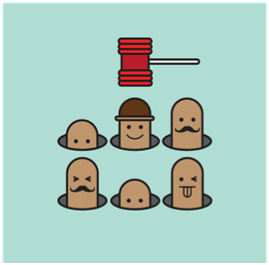
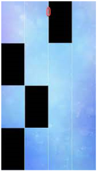
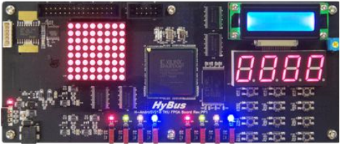

# **22.05.24 IoT 프로그래밍 1차 중간 발표**

*   **2017250044 정재현**
*   **2017250043 정유성**
*   **2016415024 이지환**

 

**목차**

1. 기존에 계획한 프로젝트

2. 계획한 프로젝트에서 추가한 기능

3. 참고문헌

 

## **1. 기존에 계획한 프로젝트**

**두더지 타일 ( 두더지 게임 + 피아노 타일 )**

**두더지 게임 측면** : 두더지를 잡을수록 두더지가 생성되고 숨는 속도가 점점 빨라짐

**피아노 타일 게임 측면** : 두더지의 색상에 따라 점수가 두배가 되거나 마이너스 되는 효과 구현

 

## **2. 계획한 프로젝트에서 추가한 기능**

**기존에 조사했던 두더지 게임에서는 단순히 두더지가 한마리씩만 나오고 점수만 얻는 형태**

하지만 기존 게임은 독창성이 조금 부족하다고 느껴 여러 기능을 추가하였습니다.

### **게임 방식**

*   두더지 vs 플레이어 형식의 게임
 
*   게임의 진행은 플레이어가 두더지를 잡지 못했을때 두더지가 점수를 획득하며, 플레이어가 두더지를 잡았을 때 플레이어가 점수를 획득하는 방식.

*   플레이어와 두더지 사이의 점수가 일정수준 차이가 날 때 승, 패가 결정된다. 

### **추가 기능**

*   두더지가 한번에 한마리씩 나오는 것이 아닌 동시에 여러 마리가 나올 수 있다.
  
*   여러번 눌러야만 잡을 수 있는 두더지가 나온다.

*   두더지뿐만 아니라 두더지 대신 아이템도 나올 수 있으며 아이템 획득 시 10,11,12번 switch가 활성화 되어 아이템을 사용할 수 있음.

*   아이템의 성능은 필드에 나와있는 두더지를 전부 없애거나, 3초동안 두더지를 자동으로 잡을 수 있게 해준다.

### **게임 장치**

*   8x8 dot matrix중 최외각을 제외한 6x6크기의 matrix에서 두더지 한마리의 크기를 2x2크기로 하는 3x3 필드

*   CLCD에 승자 표시
*   segment에 점수 or (스코어 + 맞춘 개수) 등 게임에 대한 전반적인 내용 출력 예정

*   C언어 또는 C++언어 사용 예정

 

## **3. 참고문헌**

1. 두더지 게임 사진
https://www.urbanbrush.net/downloads/%EB%91%90%EB%8D%94%EC%A7%80%EA%B2%8C%EC%9E%84-%EC%9D%BC%EB%9F%AC%EC%8A%A4%ED%8A%B8-ai-%EB%AC%B4%EB%A3%8C%EB%8B%A4%EC%9A%B4%EB%A1%9C%EB%93%9C-free-mole-game-vector/

2. 피아노 타일 게임 사진
https://webisfree.com/2016-01-25/[%EB%AA%A8%EB%B0%94%EC%9D%BC%EA%B2%8C%EC%9E%84]-%ED%94%BC%EC%95%84%EB%85%B8-%ED%83%80%EC%9D%BC2-%EA%B2%8C%EC%9E%84%EC%86%8C%EA%B0%9C-%EB%B0%8F-%EC%A0%84%EB%9E%B5

3. H-Smart4412TKU FPGA Board 사진
https://slidesplayer.org/slide/14109337/

4. SMART4412로 구현한 두더지게임
https://www.youtube.com/watch?v=DscRnxeWlbw

5. VHDL로 구현한 두더지게임
https://embejied.tistory.com/50

6. HBE-SM5-S4210로 구현한 두더지게임
https://m.blog.naver.com/PostView.naver?isHttpsRedirect=true&blogId=bieemiho92&logNo=220744722833

### **22.05.24 발표자 정재현**
