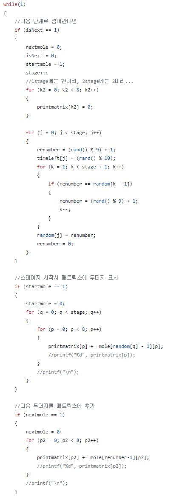
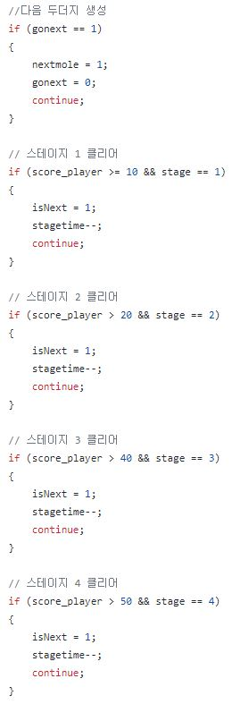
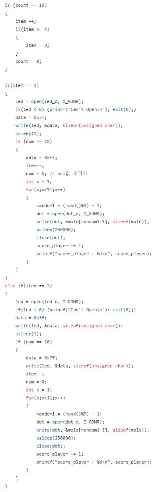
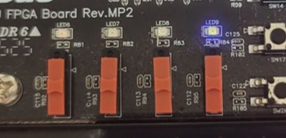
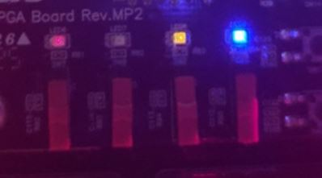
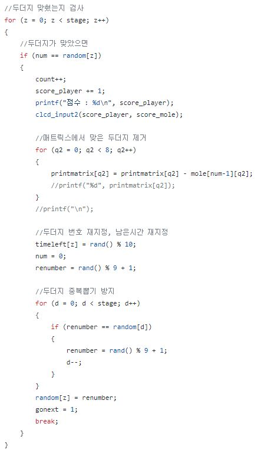
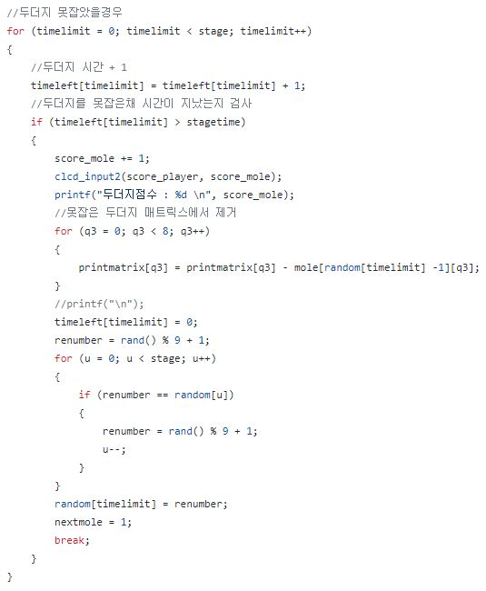
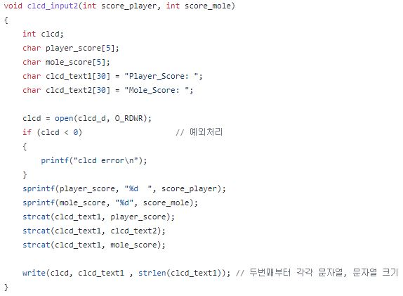
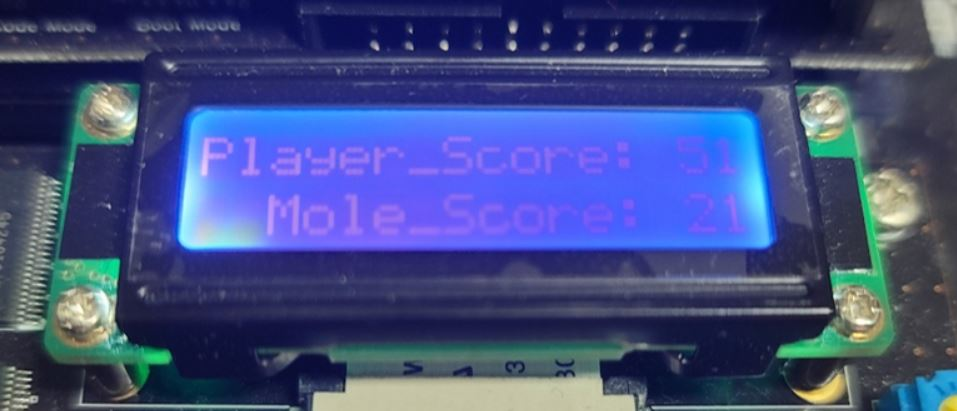

# **22.06.08 IoT 프로그래밍 최종 발표**

*   **2017250044 정재현**
*   **2017250043 정유성**
*   **2016415024 이지환**

발표일자 : 22.06.09
발표자 : 2017250043 정유성

 

*   **계획한 게임 : 두더지 타일 게임**

## 1. 계획한 게임 내용

**<기존 계획>**
+ dot matrix를 이용해 지속적으로 깜빡이는 불빛에 맞춰 해당 위치에 상응하는 Swtich를 눌러 진행하는 방식
+ 8x8 dot matrix중 최외각을 제외한 6x6크기의 matrix에서 두더지 한마리의 크기를 2x2크기로 하는 3x3 필드
+ CLCD에 (진행도 + 점수) or (스코어 + 맞춘 개수) 등 게임에 대한 전반적인 내용 출력 예정

**<수정 사항>**

+ **두더지 게임과 피아노 타일게임의 혼합된 형태의 게임   > 두더지를 잡을수록 생성되는 두더지의 수가 늘어나고 숨는 속도가 빨라지는 형태로 구현**

+ **두더지 vs 플레이어 형식의 게임  > 두더지를 잡을경우 플레이어에게 점수를, 그렇지 못할경우 두더지가 점수를 획득하는 형태   > 어느 한쪽이 특정 점수에 도달할 경우 게임 종료**

+ **HYBUS-SMART4412의 여러 부품들을 활용하여 게임 내 진행사항 표현   > Character LCD를 이용하여 플레이어(player)와 두더지(mole)이 획득한 점수 표현   > LED를 이용하여 플레이어가 획득한 아이템의 개수 출력**
 
+ **아이템을 사용하면 필드에 있는 두더지를 모두 잡는 기능 구현**

 

## 2. 독창성

+ **기존 임베디드 키트로 제작된 두더지 게임의 특징**
   - 두더지가 한번에 하나만 나오는 형식
   - 단순히 두더지를 잡는 것 외의 다른 특별한 기능 구현 X
   - 
   - 

+ **기존 게임과 다른 독창성**
   - 두더지가 한번에 여러마리 나오도록 구현
   - 두더지를 잡을수록 두더지가 숨는 속도가 점점 빨라지도록 구현
   - 다른 특별한 기능 = 아이템 기능

+ **구현 내용**
   - 두더지를 여러마리 나오게 하는 내용
   - 스테이지에 따라 두더지가 나오는 개수를 조절      
    

   - 정해진 수의 두더지를 잡으면 아이템을 획득하고 TactSwitch의 10번 버튼을 누르면 아이템을 사용하는 내용    
    
    

   - 플레이어와 두더지 간의 점수 획득 방식과 CLCD 출력에 대한 내용    
    
    
    

 
https://github.com/22IoTProject/GameProject/blob/main/Codes/main.c

 

## 3. 시연영상

https://www.youtube.com/shorts/duuKuOObT9s

 

## 4. 참고문헌

+ **CLCD 사용**
    https://hongci.tistory.com/90?category=219350    
    https://github.com/22IoTProject/GameProject/blob/main/Codes/main.c (7조 코드내용 참조)
+ **LED 사용**
    https://deepbugging.tistory.com/entry/Smart-4412-%EC%97%90-Hello-wolrd-%EC%B6%9C%EB%A0%A5%ED%95%98%EA%B8%B0
    https://github.com/gururur/IOT5T/blob/gh-pages/logicGame/logicGameVer.Final/logic5.CPP (5조 코드내용 참조)
+ **DOT MATRIX 사용**
    https://comonyo.tistory.com/16
+ **TACT SWITCH 사용**
    https://deepbugging.tistory.com/entry/HSMART-4412-%EC%97%90%EC%84%9C-Tact-Swich-%ED%99%9C%EC%9A%A9%ED%95%98%EA%B8%B0
+ **이외 참고자료**
    https://embejied.tistory.com/50(VHDL로 구현한 두더지 게임)    
    https://m.blog.naver.com/PostView.naver?isHttpsRedirect=true&blogId=bieemiho92&logNo=220744722833(HBE-SM5-S4210으로 구현한 두더지 게임)    
    https://comonyo.tistory.com/5
