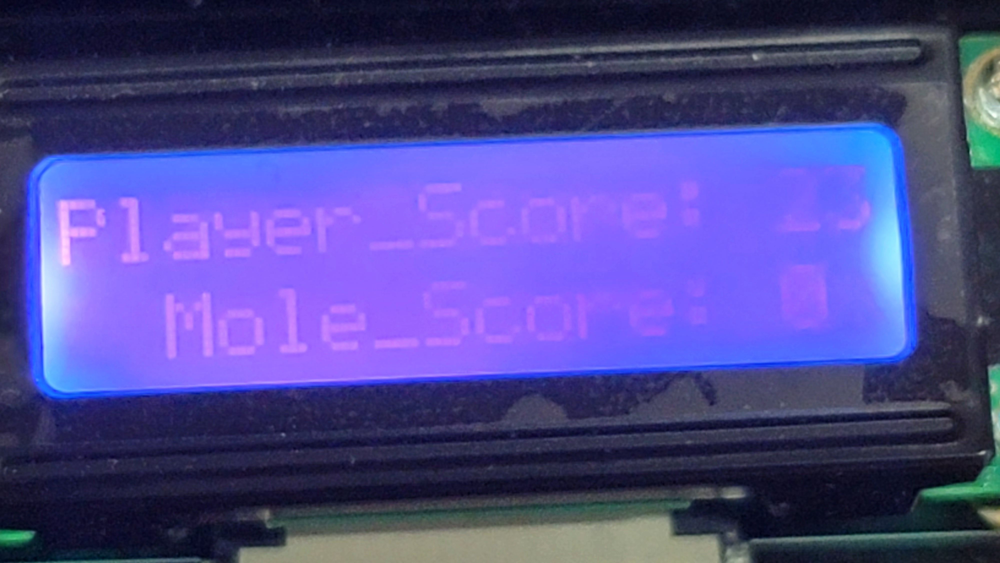

# **22.06.08 IoT 프로그래밍 최종 발표**

*   **2017250044 정재현**
*   **2017250043 정유성**
*   **2016415024 이지환**

발표일자 : 22.06.09
발표자 : 2017250043 정유성

 

*   **계획한 게임 : 두더지 타일 게임**

## 1. 계획한 게임 내용

+ **두더지 게임과 피아노 타일게임의 혼합된 형태의 게임   > 두더지를 잡을수록 생성되는 두더지의 수가 늘어나고 숨는 속도가 빨라지는 형태로 구현**

+ **두더지 vs 플레이어 형식의 게임  > 두더지를 잡을경우 플레이어에게 점수를, 그렇지 못할경우 두더지가 점수를 획득하는 형태   > 어느 한쪽이 특정 점수에 도달할 경우 게임 종료**

+ **HYBUS-SMART4412의 여러 부품들을 활용하여 게임 내 진행사항 표현   > Character LCD를 이용하여 플레이어(player)와 두더지(mole)이 획득한 점수 표현   > LED를 이용하여 플레이어가 획득한 아이템의 개수 출력**
 
+ **아이템을 사용하면 필드에 있는 두더지를 모두 잡는 기능 구현**

 

## 2. 독창성

+ **기존 임베디드 키트로 제작된 두더지 게임의 특징** 
   - 두더지가 한번에 하나만 나오는 형식 
   - 단순히 두더지를 잡는 것 외의 다른 특별한 기능 구현 X 
   - 
   
    hello world 만들기 https://comonyo.tistory.com/5

    Dot matrix 작동하기 https://comonyo.tistory.com/16

    tact sw 작동하기 https://deepbugging.tistory.com/entry/HSMART-4412-%EC%97%90%EC%84%9C-Tact-Swich-%ED%99%9C%EC%9A%A9%ED%95%98%EA%B8%B0

    CLCD 예시 코드 https://hongci.tistory.com/90?category=219350

+ **타겟시스템을 조작하는데 필오한 코드를 제외하고는 모든 코드를 직접 작성.**

    두더지 게임 사진 https://www.urbanbrush.net/downloads/%EB%91%90%EB%8D%94%EC%A7%80%EA%B2%8C%EC%9E%84-%EC%9D%BC%EB%9F%AC%EC%8A%A4%ED%8A%B8-ai-%EB%AC%B4%EB%A3%8C%EB%8B%A4%EC%9A%B4%EB%A1%9C%EB%93%9C-free-mole-game-vector/
    
 

## 3. 난이도

+ **기존 두더지잡기 프로젝트는 한마리씩 잡아가는 단순한 형태**

    VHDL로 구현한 두더지게임 https://embejied.tistory.com/50

    HBE-SM5-S4210로 구현한 두더지게임 https://m.blog.naver.com/PostView.naver?isHttpsRedirect=true&blogId=bieemiho92&logNo=220744722833

+ **그러나 스테이지 증가에 따라 두더지를 여러마리 출현시키는 것은 앞의 프로젝트보다 매우 높은 난이도를 요구함**

+ **또한 아이템사용, 두더지와 플레이어의 대결형식등의 형태로 만들기 위해 많은 부분을 추가해양만 했음.**

 

## 4. 시연 영상

https://www.youtube.com/shorts/duuKuOObT9s

**사진들**

 

**5. 코드**
[Mole_Game_main.c](https://github.com/2022HKNUiotprogrammingTeam1/project/blob/main/%EB%B0%9C%ED%91%9C%EC%9E%90%EB%A3%8C/Code/Mole_Game_main.c)
